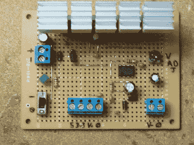
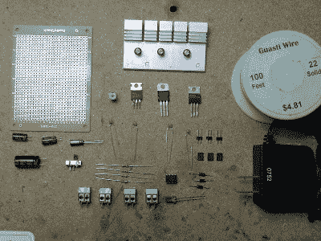
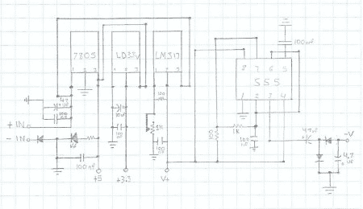
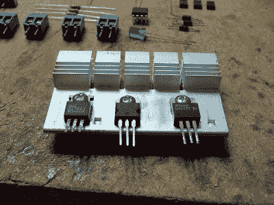
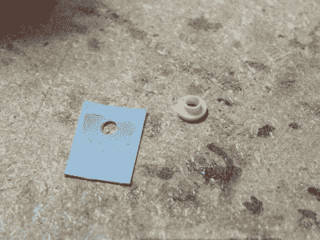
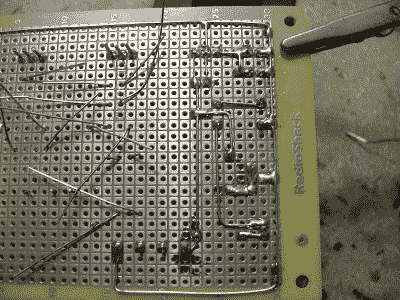
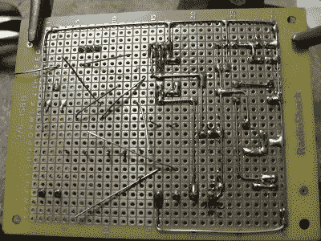
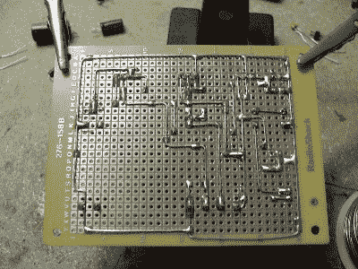
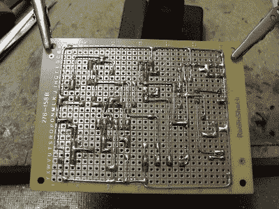
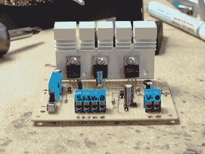

# 简单的台式电源

> 原文：<https://hackaday.com/2011/05/24/simple-bench-power-2/>

当处理电子产品时，你需要一个关键的东西，电。在相当长的一段时间里，如果我需要 5 伏电压，我会拿起我的自制 arduino，但这并不总是方便的，它被拴在 pc 上，它没有 3 伏电压。如果我想要 3 伏，现在我正在四处寻找我的 UBW32，它确实有 3 伏，但现在我有一个 50 美元的微控制器，带有非常小的调节器(因此只有小负载)，只是为了电源而晃来晃去，这很糟糕。

因此，我只需要一块电路板，从壁式电源插座中取出一些 DC，并将其调节到可用电压，我已经开始着手制作了。该调压板输出+5、+3.3、可变和负可变电压，非常容易制作，是工作台的绝佳补充。(直到有一天我能买到真正的长凳)

现在我知道这不是突破性的黑客技术，但我希望它能帮助那里的人，休息后加入我们，看看发生了什么。

 先起来，零件！我首先查阅了 3 家监管机构的数据手册，基本上放弃了他们的大部分建议，因为其中大部分都是无用的部分。乞丐不能挑肥拣瘦。

这基本上没问题，但由于我在 LM317T 上的电阻选择，我失去了一点(大约一个额外的电压！)比我应该在监管机构。我使用 100 欧姆和 1 千欧姆的电压调节… 120 和 2k 或 240 和 5k 会是一个更好的选择，如果我手头有这些零件。

但这是我最后用的

1*SPST 拨动开关

1 *您选择的 LED 和适用于 5 伏操作的适当电阻

3 *硅整流二极管(我使用 1N4001 的，但大多数会做得很好)

额定电压高于 16 伏的 2*47uf 电容器(我使用的是 50 伏电容)

1*10uf 电容器(用于 3.3 伏线路，因此任何高于 3v 的电压都适用)

1*4.7uf 电容器(我再次使用 50 伏)

6*100nf 陶瓷电容器(代码 104)

2*100 欧姆电阻器

1*1k 欧姆电阻

1 * 1 千欧姆微调电位器

1*7805 采用 TO220 封装

TO220 封装中的 1*3 伏调节器(我使用的是 ST“LD33V ”,尽管它并不常见)

1*LM317T，采用 TO220 封装

1*555 定时器

4 *双端子/螺丝块

1 *大型 3 位置散热器或 3 个垂直于 220 的散热器

电线、焊料和 2 位跳线

或多或少的电压通过电容过滤后馈入 7805 和 317T，3v3 调节器连接到 7805 的输出端(与 LED 一起),因此它不必降低大量电流，也不会在最小负载下过热。请记住，有 2 个稳压器连接到壁式电源插座上，理论上，这种电源插座最多可以消耗 2.5 安培的电流，因此，您要么需要一个能够处理这种情况的壁式电源插座，要么非常注意自己消耗的电流。

接下来是原理图..这里不多说，这是一个示意图……(点击查看大图)

更新:修复反向二极管

最后，我必须做这个东西，我选择 perf 板，一侧有铜焊垫，未绝缘的 22 号固体镀锡铜，因为我发现只要布局不太复杂，这种方法很容易。

施工从将调节器安装到散热器开始。我得到了这个散热器和许多电容器从一个旧的死电脑电源。这是相当大的，应该做得很好，但有一个陷阱。每个调节器安装片都有不同的功能，因此，除非我想将 3v3 调节器和 LM317T 的输出连接到 7805 的地，否则我需要单独的散热器或一些硅垫和尼龙垫圈隔离硬件，我的电源很好地提供了这些硬件。(只是在我扔掉它们并在垃圾堆里挖了 20 分钟之后)

 

这里是一个镜头的电源输入和 7805 所有连线和测试工作。

另一个镜头与 3v3 调节器连线，并测试工作。

另一个镜头与 317T 连线和测试工作。

最后，555 电压逆变器就位并开始工作。虽然他们生产电压逆变器，而我在某个地方有一个 5 伏的，但我更喜欢有一个可以连接到 317 的想法，因为我真的不知道我是否需要-12，或-5 或任何介于两者之间的东西。

请记住，这是一种制造负电压的蹩脚方法，它不会与 317 的正输出相平衡(二极管会损失 0.7 伏或更多)。此外，它需要几秒钟才能稳定在一个电压上，所以开始低，停止一点点短，因为它将继续上升几秒钟。通过在 555 的输出端使用较低值的电容，或许可以将这种影响降至最低，现在我使用的是 47uf，但我见过从 10 到 470 的所有电容，具体取决于你看的是哪个原理图。

无论如何，这是最终产品，我准备好了摇滚。你可能会注意到那里有一个跳线块，它会切断 317 的电源。由于电阻选择和 555 定时器输出造成的损耗，这部分电路的功耗约为 37ma，7805、led 和 3v3 调节器的功耗仅为 36ma(led 为 20ma)。所以，如果你不使用它，为什么还要给你的电源增加额外的负载呢？我可能会回去修改一下。

感谢您的关注！

