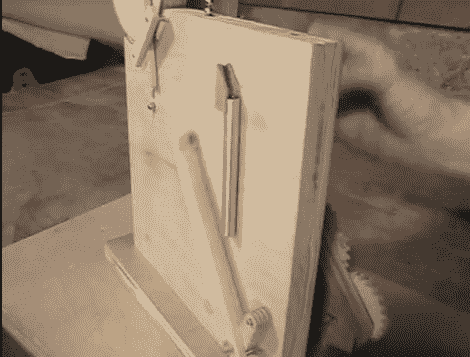

# 手摇磁铁机是无穷的乐趣

> 原文：<https://hackaday.com/2011/05/25/hand-cranked-magnet-machine-is-endless-fun/>

我们想不出有哪个人不喜欢时不时地玩一把稀土磁铁。我们知道[戴夫·约翰逊]肯定知道。作为送给他岳父的礼物，他建造了一台宏伟的机器，除了以催眠般的优雅操纵球形稀土磁铁外，没什么作用。

除了几个紧固件和杆之外，这台机器几乎完全由木头制成。甚至齿轮都是由木头精心切割而成，特别注意确保平稳运行。当转动曲柄时，机器从一条长链的一端切下一块磁铁，将它传递给一个提升臂。升降臂将磁铁放入一个金属管中，在涡流的帮助下，它慢慢向下漂移，然后再沉积在磁铁链的末端。

休息之后，请务必观看该机器的视频演示，这真的很有趣。

[via [LaughingSquid](http://laughingsquid.com/marvelous-hand-cranked-machine-for-rare-earth-ball-magnets/)

 <https://www.youtube.com/embed/W7REmfZ6O5U?version=3&rel=1&showsearch=0&showinfo=1&iv_load_policy=1&fs=1&hl=en-US&autohide=2&wmode=transparent>

 </body> </html>