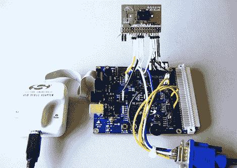

# 用 8 位微控制器进行彩色物体跟踪

> 原文：<https://hackaday.com/2011/05/25/color-object-tracking-with-an-8-bit-microcontroller/>

[Craig]发送了这个项目的链接，该项目设法在 8 位微控制器上以每秒 60 帧的速度实现了[颜色跟踪](http://chipsight.com/easy-eye-silabs-camera/)。这是相当令人难以置信的性能，但我们也不是在谈论使用业余爱好级的微控制器。 [C8051F360](http://www.keil.com/dd/chip/4200.htm) 是一款 ARM 微控制器，吞吐量为 100 MIPS，系统时钟频率最高可达 100 MHz。您还必须考虑到，在跟踪模式下，芯片将不能做任何其他事情。即使有这些问题，它仍然是相当不可思议的。

该设置使用 Omnivision OV7720 摄像头模块。它有自己的 24 MHz 时钟，用作微控制器 PLL 的时钟信号，以产生 96 MHz 系统时钟。该代码由 C 和汇编语言混合编写，通过串行端口连接将捕获的跟踪数据推送到 PC。休息之后，你可以观看一个简单的演示视频，展示摄像机看到的东西和电脑上显示的数据。

如果你有这个系统，你会用它做什么？或许这是你一直在破解的那把[彩弹哨兵枪](http://hackaday.com/2008/08/24/autonomous-paintball-sentry-gun/)的完美补充？

[https://www.youtube.com/embed/bAp0si1BOo8?version=3&rel=1&showsearch=0&showinfo=1&iv_load_policy=1&fs=1&hl=en-US&autohide=2&wmode=transparent](https://www.youtube.com/embed/bAp0si1BOo8?version=3&rel=1&showsearch=0&showinfo=1&iv_load_policy=1&fs=1&hl=en-US&autohide=2&wmode=transparent)