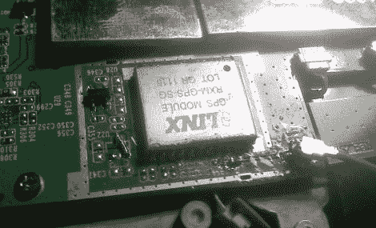

# 向 Viewsonic G-Tablet 添加 GPS

> 原文：<https://hackaday.com/2011/05/26/adding-gps-to-a-viewsonic-g-tablet/>

xda 开发者论坛上的黑客们似乎总是在酝酿着一些令人敬畏的事情，[fosser2]也不例外。他给自己买了一台优派 G-tablet，但对它没有 GPS 模块有点失望。他撬开平板电脑，希望能找到一个地方塞进一个，并对他发现的东西感到惊喜。

事实证明，要么优派曾计划包括一个 GPS 模块，并放弃了他们，或者他们正计划在未来的 SKU 增加 GPS。这款平板电脑的主板已经为该模块和 GPS 天线留出了位置。他小心翼翼地焊接了一个来自 Digikey 的兼容模块，然后开始添加使其正常工作所需的各种其他组件。

虽然黑客并不要求你在电路板上添加大量的部件，但在尝试之前，你最好确保你的焊接技能符合标准。那些不能可靠焊接 SMD 元件的人，大概应该远离这个。

[via [Engadget](http://www.engadget.com/2011/05/25/add-gps-to-your-viewsonic-g-tablet-and-test-your-soldering-skill/)