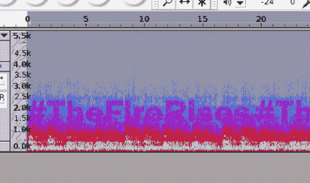

# 音频中隐藏的消息

> 原文：<https://hackaday.com/2011/05/26/hidden-messages-in-audio/>

[Alex]向我们透露了来自[http://www.thedarkknightrises.com/](http://www.thedarkknightrises.com/)的邪恶声音。当你去那里的时候，你会看到一个 wav 文件，如果你快速浏览一下状态栏，你会很容易找到这个文件的直接链接并下载它。这些都很好，但是你为什么要这么做呢？

如果你在一个支持 spectrograms 的程序(比如 audacity)中回放这个文件，你会发现在音频频谱中隐藏着一个 twitter 散列，它以一种非常好的字体呈现为纯文本。当然，这会把你带到网站的另一个地方，那里还有另一个谜题等着你。

虽然这是一种有趣的方式来激起人们对即将上映的(蝙蝠侠)电影的关注，但我们发现在音频文件中隐藏纯文本相当疯狂，尽管以前有人做过或更好，比如我们不久前发布的关于 Ham 的[以类似方式包装二维码的帖子](http://hackaday.com/2010/11/27/barcode-challenge-for-radio-operators/)。