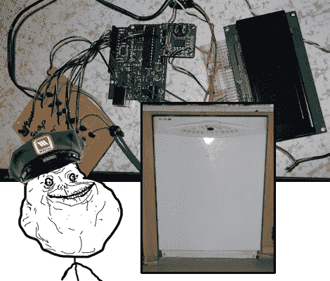

# 嘿原始设备制造商，Arduino 控制洗碗机有很大潜力

> 原文：<https://hackaday.com/2011/05/26/hey-oems-arduino-controlled-dishwasher-has-much-potential/>

我想我们都同意，有时项目是有点牵强的。我们绞尽脑汁寻找一些有趣和独特的东西带到餐桌上，最终为了那种特殊的奇怪的扭曲技巧或技术而努力，这种技巧或技术将获得我们同龄人的特别赞赏。从这个意义上说，我们很容易忽略一些最好的项目，那些简单的项目证明了你可以在任何时间任何地点修复任何东西，并且在你做的时候改进它。

这正是这种项目，[una locker]有一个洗衣机成为自身冷凝的受害者。他没有为修理工支付一大笔钱，而是自己承担了这项工作，给洗衣机安装了一个 Arduino、继电器和一块试验板。一点逆向工程揭示了(特别是标签)控制板，显然所涉及的控制信号非常容易解释。【UnaClocker】还发现了一个温度传感器来控制盘子卫生。此时，他已经完全控制了洗碗机，并能够设计理想的预洗/洗涤周期时间。

现在，洗涤周期都设置好了，[una locker]现在可以继续下去，让 OEM 难堪。他计划增加一个实时时钟模块来记录洗涤时间和一个干净的盘子指示器，之后我们认为他应该开始一些无线/推特/以太网/电容触摸/语音通信。在那之后，他将把设计扣上，并把它做得漂亮些。

查看跳跃后的运行设置！

[https://www.youtube.com/embed/up5q2SokrKA?version=3&rel=1&showsearch=0&showinfo=1&iv_load_policy=1&fs=1&hl=en-US&autohide=2&wmode=transparent](https://www.youtube.com/embed/up5q2SokrKA?version=3&rel=1&showsearch=0&showinfo=1&iv_load_policy=1&fs=1&hl=en-US&autohide=2&wmode=transparent)