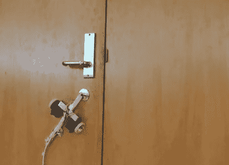

# 爬壁机器人采用超声波抓手

> 原文：<https://hackaday.com/2011/05/26/wall-climbing-robot-uses-supersonic-grippers/>

小心蜘蛛侠，镇上来了一个新的爬墙高手！

研究人员[马修·朱尼、陈小奇、詹姆斯·罗伯逊、马克·杰米和马修·塞利耶]最近在 2011 年 IEEE 机器人和自动化国际会议上展示了他们的攀爬奇迹机器人。像大多数其他爬壁机器人一样，他们的机器人根据伯努利原理来保持其附着在表面上，但相似之处仅此而已。

与其他基于伯努利原理的攀岩者不同，这个机器人的手爪从未真正接触到它正在攀爬的表面。研究人员能够通过设计一种专门的夹子来完成这一壮举，这种夹子迫使空气通过 25 微米的间隙，产生一个非常强大的低压涡流。该手爪的设计仅通过形状压缩空气，使气流速度达到 3 马赫，而不依赖于强大的泵或增加的空气量。

研究人员表示，他们的超音速手爪可以支撑大约五倍于传统伯努利手爪的重量，正如你在下面的视频中看到的那样，它在爬各种表面上也没有问题。

擦窗 Roomba，我们来了！

[通过[使](http://blog.makezine.com/archive/2011/05/wall-ceiling-climbing-robot-with-supersonic-air-jet-grippers.html)

 <https://www.youtube.com/embed/eEcDS1Vhp3o?version=3&rel=1&showsearch=0&showinfo=1&iv_load_policy=1&fs=1&hl=en-US&autohide=2&wmode=transparent>

 </body> </html>