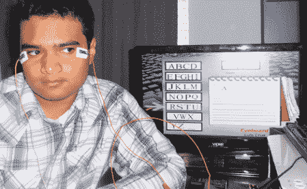

# 通过测量眼睛中的电子来跟踪眼球运动

> 原文：<https://hackaday.com/2011/05/26/tracking-eye-movement-by-measuring-electrons-in-the-eye/>

[路易斯·克鲁斯]是一名洪都拉斯高中生，他建造了一个令人惊叹的[眼电描记系统](http://www.ees.intelsath.com/home.html)，而这个项目的[报道](http://www.ees.intelsath.com/EES-EOG.pdf) (PDF 警告)是我们见过的最好的之一。

[Luis]讲述了眼电图的理论——由于视网膜神经末梢中的负电荷，人眼从前向后偏振。由于这种微小的电荷差异，用户的目光可以通过附着在眼睛周围皮肤上的电极来跟踪。在将眼睛电极连接到运算放大器和微控制器后，[Luis]用 Python 脚本导入了数据，并编写了一个“eyeboard”应用程序，只需通过眼球运动就可以进行文本输入。该项目的最初目标是为重度残疾人建立一个界面，但[Luis]看到了睡眠研究和收集营销数据的应用。

我们去年报道过[Luis]' [家酿 8 位控制台](http://hackaday.com/2010/03/26/8-bit-game-console-with-wireless-motion-controller/)，他现在正在用他的眼球追踪装置控制他的 Pong 克隆体。我们想起了雅达利开发的[类似系统](http://www.atarimuseum.com/videogames/consoles/2600/mindlink.html)，但【路易斯】的系统使用的方法不会让用户在 15 分钟后感到头痛。

休息之后，看看[Luis]在体验他的界面功能。

[https://www.youtube.com/embed/JlgKOV_mn18?version=3&rel=1&showsearch=0&showinfo=1&iv_load_policy=1&fs=1&hl=en-US&autohide=2&wmode=transparent](https://www.youtube.com/embed/JlgKOV_mn18?version=3&rel=1&showsearch=0&showinfo=1&iv_load_policy=1&fs=1&hl=en-US&autohide=2&wmode=transparent)