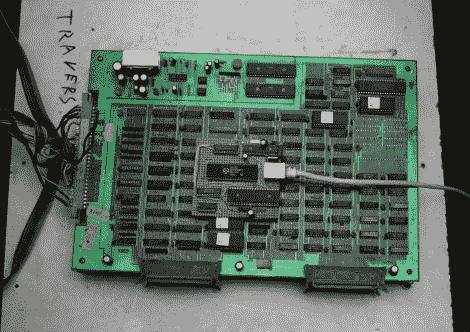

# 为老式街机添加永久内存和以太网

> 原文：<https://hackaday.com/2011/05/27/adding-persistent-memory-and-ethernet-to-vintage-arcade-machines/>

如果你是一个经常阅读的人，你无疑对 hacker [Sprite_tm]很熟悉。他一直在与 TkkrLab hackerspace 的成员合作，为 5 月 28 日的正式盛大开幕做准备，并写信分享了他最近完成的一个项目。

作为准备工作的一部分，他们已经在这个地方储备了各种黑客友好的好东西，包括大量的工具和俱乐部伙伴，以及一个老式的“1943 年”街机柜。这个游戏是一个团体的最爱，尽管每次电源关闭，它都会失去所有来之不易的高分。[Sprite_tm]知道他可以改进当前基于纸张的分数登记簿，所以他打开机器看看可以做些什么。

他使用 AVR 接入机器的 Z80 逻辑板，允许他随时读写游戏的全部 RAM。这使他能够记录高分，每当机器重新通电时，就将它们恢复到内存中。AVR 的加入也让他增加了一个 TCP/IP 接口，每当有人打破之前的记录时，这个接口就会向 Twitter 发送高分。

他的模块化总线 tap 可用于各种基于 Z80 的硬件，因此如果您有一些老式设备，请务必访问他的网站，更详细地了解构建过程。