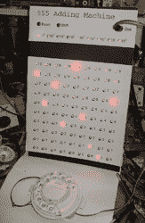

# 简约 555 加法机

> 原文：<https://hackaday.com/2011/05/27/minimalistic-555-adding-machine/>

将两个 10 位数相加需要多少个 555 定时器？555 加法机用 102 个加法机做，他设计这台机器作为 555 竞赛的极限参赛作品，最初的计划是让它变得更复杂。这台机器使用 555 实现了一个 90 年的累加器和多路复用器，所有的输入都是由一个老式的转盘电话控制的，它显然提供了很好的定时输出。加减法是使用 9s 恭维算法实现的，他在休息后的视频中讨论了这一算法，适用于任何想重温 9s 恭维或 555 理论的人。

Alan 的网站上有一些很好的图片(所有这些极简的焊接给我们留下了特别深刻的印象)，包括原理图和一个非常好的 33 分钟视频，其中他详细讨论了机器如何工作，甚至提供了 Pascaline 的一些历史，Pascaline 是一种基于类似原理工作的机械计算器。

 <https://www.youtube.com/embed/SVOliDG4AAc?version=3&rel=1&showsearch=0&showinfo=1&iv_load_policy=1&fs=1&hl=en-US&autohide=2&wmode=transparent>

 </body> </html>