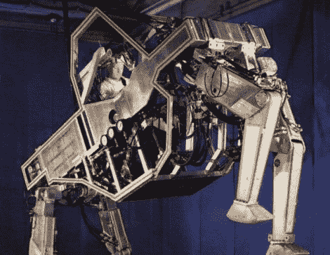

# 以前的四足军用车辆

> 原文：<https://hackaday.com/2011/05/28/quadruped-military-vehicles-from-back-in-the-day/>

虽然波士顿动力公司的大狗令人印象深刻，但[看看美国陆军首次尝试四足车辆的视频](http://www.youtube.com/watch?v=ZMGCFLEYakM)。20 世纪 60 年代初，在通用电气公司的帮助下，这项军事实验首次成功地用机械机器复制了一只四条腿的动物。

这种“行走卡车”由一名操作员驾驶，他使用力反馈液压杠杆移动车辆的每一条腿。编排机器的动作相当复杂，在测试过程中，军方发现操作者只使用了 15 分钟就需要休息一下。正如你在视频中看到的，车辆弯曲了一些严重的肌肉。它可以毫不费力地踢开一辆吉普车，但由于操作者收到的触觉反馈水平，它仍然能够轻轻地踩在灯泡上而不会打碎它。

如果不是政府削减预算，我们现在就可以实现乔治·卢卡斯的基于 AT-AT 的战斗梦想！

[通过 [Gizmodo](http://gizmodo.com/5806193/the-army-had-their-own-at+at-years-before-george-lucas-invented-his)