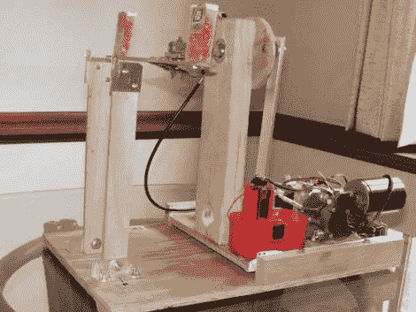

# 这个机器人可以在无意义的游戏中打败你

> 原文：<https://hackaday.com/2011/05/28/this-robot-can-beat-you-at-pointless-games/>

我们已经知道机器人可能比我们聪明，沃森在《危险边缘》中击败了肯·詹宁斯，深蓝在国际象棋中击败了加里·卡斯帕罗夫就是明证。现在[E024576]正在努力[制造一个机器人来参加体育比赛](http://www.instructables.com/id/Mad-Dog-Robot)。

为了迎接挑战，他从电视游戏节目《一分钟》中选择了一个游戏来赢得它。这个挑战被称为疯狗，并以它的名字命名这个机器人。目标是拿起一把粘有两个 tic tac 容器的尺子，然后摇动它，直到所有的糖果都从容器中弹出。休息之后，看看他在视频中提出了什么。该机器由 PIXAXE 微控制器驱动，输入来自 IR 遥控器。它伸出手，紧紧地抓住尺子，摇晃着，就像没有明天一样。令人印象深刻，即使它的运作没有什么目的。这对机器人来说是个完美的任务，对吗？

 <https://www.youtube.com/embed/OP4QTcKo53s?version=3&rel=1&showsearch=0&showinfo=1&iv_load_policy=1&fs=1&hl=en-US&autohide=2&wmode=transparent>

 
 
 </body> </html>