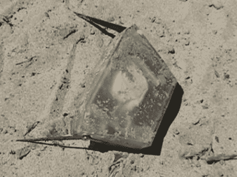

# Aquabot 比你想象的要到处跑

> 原文：<https://hackaday.com/2011/05/29/aquabot-gets-around-more-than-youd-think/>

这没有我们希望从高科技机器人身上看到的浮华的未来主义吸引力，但这个两栖流浪者非常适合它的预期目的。它是由明尼苏达大学的研究人员开发的，用于在大多数潮湿的环境中导航，收集水质数据，作为分布式传感器机器人大军的一部分。

它前面伸出的两个小臂是碳纤维制成的，连接在内部的伺服电机上。折叠下方的视频显示了梯形身体翻转过来四处走动。但是这种笨拙的，像小海龟一样的移动方式并不是它运动技巧包中唯一的东西。它还可以调整浮力，在潮湿的地方漂浮、下沉或悬停。

为了更好地了解这项研究的进展，让我们来看看几年前在 UMN 开发的 Adelopod。我们还嵌入了那个翻滚机器人的视频，因为它们分享了我们一直在寻找的构建细节。

 <https://www.youtube.com/embed/GaAHO9TFlVQ?version=3&rel=1&showsearch=0&showinfo=1&iv_load_policy=1&fs=1&hl=en-US&autohide=2&wmode=transparent>

 
 
 
Adelopod:
 <iframe class="youtube-player" width="800" height="480" src="https://www.youtube.com/embed/WPEL4JOk7Vs?version=3&amp;rel=1&amp;showsearch=0&amp;showinfo=1&amp;iv_load_policy=1&amp;fs=1&amp;hl=en-US&amp;autohide=2&amp;wmode=transparent" allowfullscreen="true" style="border:0;" sandbox="allow-scripts allow-same-origin allow-popups allow-presentation"/> 
[通过<a href="http://www.engadget.com/2011/05/26/amphibious-aquapod-might-be-the-clumsiest-robot-ever-video/" target="_blank"> Engadget </a>和<a href="http://io9.com/5805523/aquatic-robot-conquers-land-and-sea-while-looking-like-a-space-invader" target="_blank"> io9 </a>
 </body> </html>