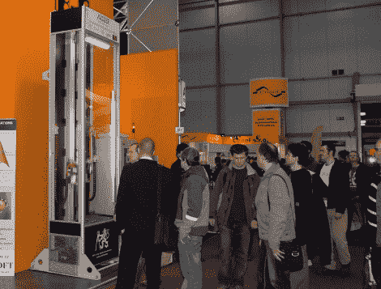

# 机器人杂耍手肯定能处理很多球

> 原文：<https://hackaday.com/2011/05/28/robot-juggler-sure-handles-a-lot-of-balls/>

这个变戏法的机器人，如上图所示，出现在 2010 年 [Amper](http://www.amper.cz/) 展会上，它可以同时将五个球保持在空中。它是由位于布拉格的捷克技术学院控制工程系设计的。我们知道它在那个静止图像中看起来不太像，但是在休息之后嵌入的两个视频是纯金的。

手臂在垂直轨道上表演杂耍。它们可以在所述轨道上上下移动，并且连接到每个轨道上的圆形夹具可以水平枢转。第三个致动器位于机器的底部，收集任何可能掉落的球，并将它们发射回杂耍手的领域。高速摄像机有助于物体跟踪，就像四轴飞行器控制一样。

在那个保护罩里扔来扔去的东西是台球。我们猜测，增加的质量有助于抑制投掷或捕捉中的任何小的不规则性。

[https://www.youtube.com/embed/gIheAjvEiBE?version=3&rel=1&showsearch=0&showinfo=1&iv_load_policy=1&fs=1&hl=en-US&autohide=2&wmode=transparent](https://www.youtube.com/embed/gIheAjvEiBE?version=3&rel=1&showsearch=0&showinfo=1&iv_load_policy=1&fs=1&hl=en-US&autohide=2&wmode=transparent)

[https://www.youtube.com/embed/f2leH_kvg0U?version=3&rel=1&showsearch=0&showinfo=1&iv_load_policy=1&fs=1&hl=en-US&autohide=2&wmode=transparent](https://www.youtube.com/embed/f2leH_kvg0U?version=3&rel=1&showsearch=0&showinfo=1&iv_load_policy=1&fs=1&hl=en-US&autohide=2&wmode=transparent)