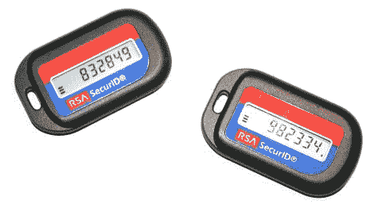

# RSA SecurID 漏洞导致洛克希德·马丁公司遭到入侵

> 原文:https://hackaday . com/2011/05/28/RSA-securid-breaking-leads-intrusion-at-Lockheed-Martin/

看起来洛克希德·马丁公司是似乎无休止的一连串安全漏洞的最新受害者。然而，这一次，它看起来不像是缺乏安全措施导致的违规。事实上，洛克希德公司实施的一个广受信任的安全工具似乎是这次的攻击媒介。

上个月[我们报道了 RSA 的 SecurID 产品](http://hackaday.com/2011/04/13/rsa-securid-two-factor-authentication-comprimised/)的明显漏洞，虽然许多人猜测这次入侵可能会导致后续攻击，但该公司淡化了这次漏洞。他们表示，被盗数据不太可能影响他们的客户，但像往常一样，问题似乎比最初估计的要大得多。

入侵的广度目前还不得而知，由于 RSA 和洛克希德官员都保持沉默，可能需要一段时间才能有人知道它有多严重。然而，当军事机密受到质疑时，你知道这可不好！