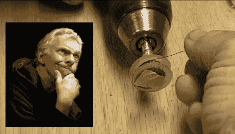

# 吉他拾音器 101

> 原文：<https://hackaday.com/2011/05/31/guitar-pickup-101/>

[迪诺·塞戈维斯]又来了！在本周的“黑客一周”系列中，迪诺拿着一个吉他拾音器，绕着 101 号线。专业吉他拾音器的价格可能高达数百美元，但本质上都是一个包裹在一束电线中的永久磁铁。使用一些便宜的耳机，电磁线和一个备用螺栓[迪诺]制作了他自己的拾音器，并将其放在一个单弦蓝调吉他中。这是一个很好的初学者项目，因为它只涉及几个很容易找到的部分，并涉及一些有趣的概念，如电感和磁通量。

前提非常简单:将耳机磁铁夹在两个塑料圆盘之间，制成一个转轴，将 1/4”螺栓热粘合到转轴上，连接到电钻上，并在上面缠绕几千圈磁线。把你的线圈挂在一个放大器上，放一个果酱。

我们可能会尝试在钻机上添加一个计数器，使用一个簧片开关连接到一个便宜的袖珍计算器的“=”键，并在螺栓上粘上一块磁铁。我们也看到了更复杂的自动绕线器，但是迪诺保持了它的简洁。

看看视频后，跳转听到[迪诺]去所有晕船史蒂夫对我们。

[https://www.youtube.com/embed/wKS0ZWCHI4g?version=3&rel=1&showsearch=0&showinfo=1&iv_load_policy=1&fs=1&hl=en-US&autohide=2&wmode=transparent](https://www.youtube.com/embed/wKS0ZWCHI4g?version=3&rel=1&showsearch=0&showinfo=1&iv_load_policy=1&fs=1&hl=en-US&autohide=2&wmode=transparent)