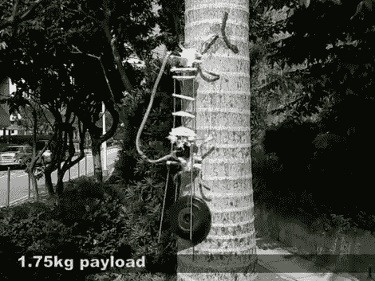

# 爬树者从尺蠖书上取下一页

> 原文：<https://hackaday.com/2011/05/30/tree-climber-takes-a-page-from-the-inchworm-book/>

锋利的爪子和强壮的躯干让这个机器人能够爬树，即使它背负着沉重的负载。它使用一个简单的原理，两个抓握单元让它可以抓住树。这些模块交替出现，当躯干移动另一个模块到树上时，一个模块抓紧另一个模块。

你可以辨认出上图中连接机器人前半部分和后半部分的三根杆。休息后观看视频，看看电机如何以尺蠖的灵巧移动这些杆，使它不仅能向上爬，还能弯曲和伸缩，以适应在野外遇到的轮廓。

这是几周前在机器人和自动化国际会议上提出的。不幸的是，我们只能找到论文的摘要，所以如果你知道哪里可以找到完整的文章，请在评论中留下链接。

 <https://www.youtube.com/embed/zmqDePXM89Y?version=3&rel=1&showsearch=0&showinfo=1&iv_load_policy=1&fs=1&hl=en-US&autohide=2&wmode=transparent>

 
[途径<a href="http://www.adafruit.com/blog/2011/05/27/tree-climbing-robot/" target="_blank"> Adafruit </a>
 </body> </html>