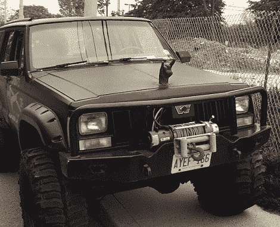

# 我卡车的引擎盖上装饰着魔鬼角

> 原文：<https://hackaday.com/2011/06/01/devil-horns-adorn-the-hood-of-my-truck/>

当你猎杀僵尸时，你必须让他们害怕。[Shannon Larratt]正在为这种可能性做准备，他在引擎盖上添加了恶魔角作为装饰。从远处看，它令人敬畏，但当你看到特写镜头时，你会意识到这是多么逼真。那是因为它不是雕塑。[Shannon]用他自己的手做的模型来铸造这个装饰品。

这个过程是从一些牙齿藻酸盐开始的，当他摆出魔鬼角的姿势时，他把这些藻酸盐弄得满手都是。模子硬化后，他用快速固化的黑色塑料树脂铸造了这个装饰品。

现在有了这个装饰品，他需要一个方法把它固定在他的汽车引擎盖上。他拿起一个带螺纹的 U 形螺栓。在装饰物的底部刻了一个洞和一个槽，以容纳 U 形螺栓和一个直螺栓，用于三个锚定点。更多的黑色树脂填充了孔，固定了螺栓，通过在发动机罩上钻孔可以轻松安装装饰物。

我们还发现，在这个过程中,[香农]花时间铸造了他女儿的拳头，用作家里的门把手，这太棒了。