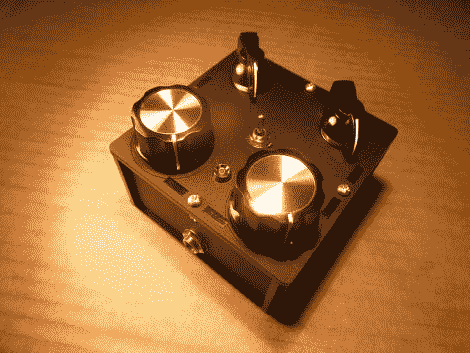

# 险恶的音调发生器带来了低音

> 原文：<https://hackaday.com/2011/06/01/sinister-tone-generator-brings-the-bass/>

[rich 分贝]来信分享了他制作的名为“[辛斯特音调发生器](http://richdecibels.com/blog/?p=166)”的新设备。它基本上是一个低音无人机合成器，使用两对外差振荡器来产生输出。如果你去他的网站，他有一个很长的设备运行的音频演示，并应用了一点混响和过滤来增强声音。听完之后，我们一致认为这听起来相当险恶！

该设备相对较小，包装在一个塑料项目盒中，这是他由 Ponoko 定制的。[Rich]说，这个特别的单元是他为一个慈善拍卖制作的一次性产品，如果你真的想得到它，招标将在周日结束。如果你碰巧有时间自己做一个，他已经把原理图和布局文件上传到他的网站上了(像往常一样)，所以请随时过来拿一份。