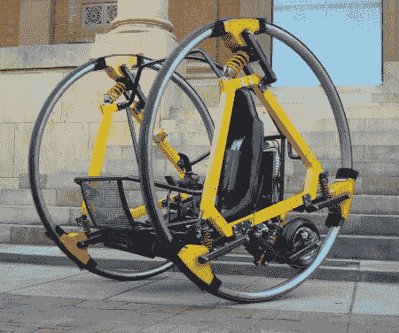

# 爱德华，未来的交通工具

> 原文：<https://hackaday.com/2011/06/02/edward-the-vehicle-of-the-future/>

如果有一个关于未来最酷的交通工具的竞赛，diwheel 将与悬浮汽车和心灵传输并列榜首。在过去的三年里，阿德莱德大学的学生们一直在研究一种叫做 T2、T4 和爱德华的电动自行车。

EDWARD 是一款完全电动的 diwheel，操作员通过一个 5 点式安全带被绑在两个大轮子之间的斗式座椅上，并可以通过游戏操纵杆控制机器。完全的动态稳定性和晃动控制允许操作员以高达 40 公里/小时的速度操纵车辆，反转控制甚至允许您颠倒驾驶(如果您倾向于那个方向)。下一个问题是我们能在哪里得到一个？休息之后，请观看视频，观看爱德华的实际操作演示。

 <https://www.youtube.com/embed/Uf6Gh-hPDeo?version=3&rel=1&showsearch=0&showinfo=1&iv_load_policy=1&fs=1&hl=en-US&autohide=2&wmode=transparent>

 </body> </html>