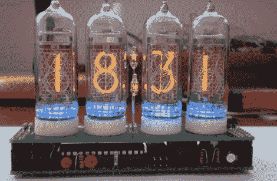

# 暖管钟，第二次

> 原文：<https://hackaday.com/2011/06/03/warm-tube-clock-take-2/>

[Mure]写信告诉我们他已经完成了他的暖管谢妮钟的第二次迭代。我们去年在这里展示了他的原创作品，虽然许多东西保持不变，但他仍然发现了一些他可以改进的地方。

第一个显著的特点是新的实时时钟。他选择使用 DS3231 RTC IC，而不是使用分立晶体计时和温度传感器进行补偿。它比晶体精确得多，并且它还具有内置的温度传感器。警报功能也得到简化，将控件移入固件，而不是使用滑动开关来实现。

随着主板的重新设计，很容易将他为他的第一个时钟创建的谢妮“屏蔽”抛在脑后，但出于对互操作性的关注，他选择让这个时钟与 version one 的屏蔽完全兼容，反之亦然。

虽然这些变化并不是突破性的，但很高兴看到像这样的项目经历持续的改进。如果你想复制这个时钟，[Mure]已经确保所有的原理图和源代码都在他的网站上。

继续阅读，观看时钟运行的简短视频演示。

 <https://www.youtube.com/embed/G4ehGTG4MEM?version=3&rel=1&showsearch=0&showinfo=1&iv_load_policy=1&fs=1&hl=en-US&autohide=2&wmode=transparent>

 </body> </html>