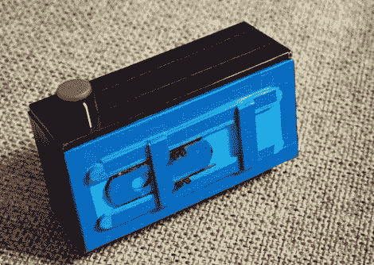

# 建立自己的全景针孔相机

> 原文：<https://hackaday.com/2011/06/04/build-your-own-panoramic-pinhole-camera/>

虽然数码相机似乎是王道，但一些人仍然喜欢用 35mm 老胶片拍摄——高中教师兼摄影师科斯塔斯·考纳斯当然喜欢。他最近在 DIY photography 上发布了一款 35mm 针孔相机的计划，我们认为你可能会喜欢。

[Costas]为相机准备了一套简单的手绘方案，您可以利用一点空闲时间轻松复制。这款相机主要由 1 毫米和 3 毫米两种口味的卡片制成，还包含冰棒棒和铝罐。冰棒棍被用来为相机创建一个手动快门，而易拉罐被用来形成针孔光圈。

正如你所看到的，这是一个非常简单的破解，连一个电子部件都没有。然而，这将花费你一些时间来建造，因为你需要让胶水在某些步骤之间变干。

爱它或离开它，你必须承认它拍摄的全景照片非常好！

如果我们激起了你对针孔摄像机的兴趣，一定要看看这个[乐高针孔摄像机](http://hackaday.com/2010/12/30/lego-pinhole-camera/)以及这个[啤酒罐针孔摄像机](http://hackaday.com/2010/04/16/beer-can-pinhole-camera/)。

[via [Lifehacker](http://lifehacker.com/5808305/make-an-diy-35mm-panoramic-pinhole-camera-on-the-cheap)