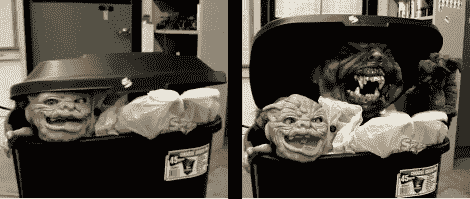

# 万圣节道具:垃圾桶玩偶盒

> 原文：<https://hackaday.com/2011/06/06/halloween-props-trash-can-jack-in-the-box/>

去年[鲍勃]没有让孩子们得到一些糖果，继续他们的路，而没有先给他们一个相当大的惊吓。他改装的垃圾桶引诱你进去，然后吓得你魂飞魄散。

他称之为垃圾机器人奥斯卡。左边的图片显示了一个看起来很恐怖的头从部分打开的垃圾桶盖中探出。它有一些运动，但缓慢而安静。这些微小而缓慢的动作会吸引你的眼球，而且看起来足够安全。直到你靠近一点。当不知情的受害者靠近时，测距仪触发，导致一只更大、更快、更血腥的野兽弹出并伸出爪子。休息过后，请看两段视频。其中一个展示了爪形机械装置，它是在制动索的帮助下制作的，展示了非常逼真和惊人的快速运动。另一个是整个设置如何工作的概述。

[https://www.youtube.com/embed/fYpjM76gNEY?version=3&rel=1&showsearch=0&showinfo=1&iv_load_policy=1&fs=1&hl=en-US&autohide=2&wmode=transparent](https://www.youtube.com/embed/fYpjM76gNEY?version=3&rel=1&showsearch=0&showinfo=1&iv_load_policy=1&fs=1&hl=en-US&autohide=2&wmode=transparent)

[https://www.youtube.com/embed/oBFVg1RHt34?version=3&rel=1&showsearch=0&showinfo=1&iv_load_policy=1&fs=1&hl=en-US&autohide=2&wmode=transparent](https://www.youtube.com/embed/oBFVg1RHt34?version=3&rel=1&showsearch=0&showinfo=1&iv_load_policy=1&fs=1&hl=en-US&autohide=2&wmode=transparent)

[谢谢亚历克斯]