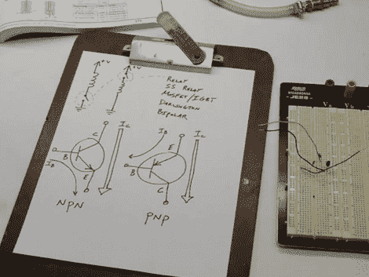

# 初学者概念:设计晶体管控制电路

> 原文：<https://hackaday.com/2011/06/06/beginner-concepts-designing-transistor-control-circuits/>

需要使用微控制器打开或关闭某些东西吗？使用晶体管是实现这一目标的最佳方式之一，但如何设计晶体管开关呢？[Ben Krasnow]整理了一个教程，其中他出色地解释了设计晶体管控制电路的来龙去脉。

休息之后我们嵌入了他的 20 分钟视频。在书中，他谈到了晶体管的用途，NPN 和 PNP 晶体管的区别，以及使用晶体管时需要了解的设计细节。我们认为初学者会发现[Ben]对如何计算 Hfe 的演示，Hfe 是完全开关晶体管所需的基极电流。如果这对你来说是胡言乱语，不要害怕。[本的]指示清晰易懂。

视频中我们忽略了一点，那就是 PNP 晶体管的基极电流保护。[Ben]提到 PNP 的基极上没有简单的电路可以用来调节从发射极到基极的电流，但他没有详细说明。否则，这就是我们在这个话题上想要的一切。

 <https://www.youtube.com/embed/8DMZSxS-xVc?version=3&rel=1&showsearch=0&showinfo=1&iv_load_policy=1&fs=1&hl=en-US&autohide=2&wmode=transparent>

 </body> </html>