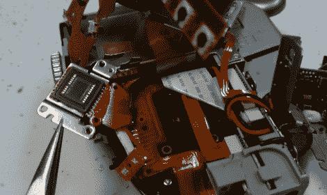

# 佳能 A70 CCD 更换/维修

> 原文：<https://hackaday.com/2011/06/04/canon-a70-ccd-replacementrepair/>

在寻找水下相机设置时，[Imsolidstate]在易贝以大约 45 美元的价格买到了佳能 A70 和佳能防水外壳。不幸的是，相机带来了一个不起作用的 CCD。另一次去网上拍卖网站让他得到了一个替代 CCD，他开始安装它。

我们有这种型号的相机，液晶显示屏有裂痕。因为我们喜欢在东西上乱搞，所以我们把它拆开来替换屏幕，相信我们，那东西里面没有多余的空间。休息后的视频显示了拆卸过程，你可以看到拆开这个单元是多么痛苦。这一过程只是在重组本身的困难黯然失色。

最后，这不是 CCD 本身的问题，而是 PCB 上接收扁平电缆的连接器的问题。它没有紧紧抓住隐形眼镜，但[Imsolidstate]用一块精心放置的泡沫解决了这个问题。

 <https://www.youtube.com/embed/9Znno5MhP2k?version=3&rel=1&showsearch=0&showinfo=1&iv_load_policy=1&fs=1&hl=en-US&autohide=2&wmode=transparent>

 </body> </html>