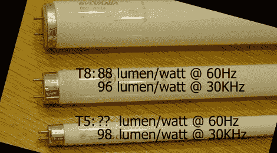

# 商店照明:权衡成本和效率

> 原文：<https://hackaday.com/2011/06/04/shop-lighting-weighing-cost-and-efficiency/>

[Ben Krasnow]想要升级他的商店照明，但在他做出任何决定之前，他决定自学现有的选项。幸运的是，他分享了关于不同照明的成本和效率的事实。

他的旧装置使用 T12 灯泡的荧光灯。这些灯泡体积庞大，效率低下。许多人，包括我们自己，会认为 LED 是合理的替代品。[Ben]首先研究了各种可用的高亮度 LED 模块。他抓起一个目录，开始做一些不同的计算，比较前期成本的流明/美元和运营成本的流明/瓦特。毫无疑问，新的荧光灯泡在这两方面都更便宜，并且提供更宽的光谱。

下一个决定是购买效率极高的新型 T5 灯泡，还是购买比 T12 标准更好但可以使用相同灯具的 T8 灯泡。经过一番挖掘，他发现 T5 并不比 T8 高效多少，但他们使用电子镇流器来提高效率。他最终用电子镇流器取代了旧的磁镇流器，以获得更高的 T8 效率，其成本低于购买新的 T5 灯具。

在休息之后的剪辑中，可以看到[本]自己对这一过程的叙述。

 <https://www.youtube.com/embed/UQ7BIyEd89U?version=3&rel=1&showsearch=0&showinfo=1&iv_load_policy=1&fs=1&hl=en-US&autohide=2&wmode=transparent>

 </body> </html>