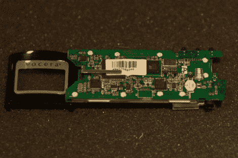

# Vocera B1000A 拆卸

> 原文：<https://hackaday.com/2011/06/05/vocera-b1000a-teardown/>

[Gray]在 Geek Chique 遇到了一点易贝事故，突然成为 16 Vocera B1000A 徽章的骄傲拥有者。如果你不熟悉，这些徽章是小巧轻便的通信设备，类似于著名的 Star Trek communicator，允许用户通过 VOIP 与其他人通话。他正致力于通过重新实现服务器软件来使剩余的徽章正常运行，并认为既然他购买的一个徽章不工作，他还不如把它拆开。

他花了一段时间把制作精良的徽章拆开，需要一个旋转工具和一些额外的工作。在里面，他发现设备被分成两块电路板，一块是“WiFi”板，另一块是“CPU”板。WiFi 板使用了 Prism WiFi 芯片组，这在建造的时候是非常普遍的。如你所料，CPU 板配有小型 SRAM 和闪存芯片，德州仪器(Texas Instruments)的 5490A DSP 正在运行。

虽然拆除设备是否有助于[Gray]重新启动和运行还有待观察，但仔细看看自己正在处理的东西也无妨。