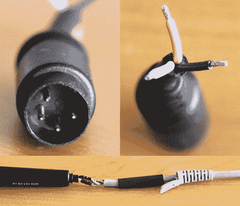

# 将软线放回 RDS 80 焊接站

> 原文：<https://hackaday.com/2011/06/05/putting-the-flex-back-into-the-rds-80-soldering-station/>

[Markus] [希望升级他的焊接站](http://www.jave.de/blog2/?p=130)，并且在过去与 Ersa 的合作中运气不错，他选择购买他们的一个新焊接站 RDS 80。

然而，当他将熨斗带回家时，他非常失望地看到，虽然他以前的 Ersa 型号使用硅胶电缆将熨斗连接到基站，但他的新熨斗却使用了坚硬、不耐热的 PVC 电缆。他发现很多人在网上抱怨同样的问题，但似乎没有人有解决办法，所以他开始自己解决这个问题。

他认为他可以拆开熨斗，一旦拆开就把电线换出来，但似乎没有办法不破坏它就这样做。相反，他切断了烙铁末端的电线，换上了一根新的硅胶电缆。他在基站端做了同样的事情，因为他被迫重新使用 Ersa 决定在那里使用的专有 4 针插头。

他的修改效果很好，现在他正愉快地焊接。

如果你碰巧有一个这样的焊接站，一定要去他的网站，近距离看看他是如何更换电缆的。