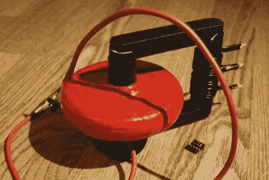

# 一个大变压器，因为很酷！

> 原文：<https://hackaday.com/2011/06/05/a-big-transformer-because-its-cool/>

[掷弹兵]有一些备用电线，绝缘胶带，和一个巨大的铁氧体磁芯，并决定创造一个巨大的，看起来很漂亮的圆盘形反激变压器。他被称为“fry back ”( T1 ),声称它将“恢复你的健康，给你的家庭带来惊人的财富和繁荣”。

他选择了一个圆盘形的变压器，因为它们看起来很酷，很公平..(哦，他们降低了绕组间电容和层间电压差)。构造相当简单，但是很费时间。Grenadier 在他的网站上介绍了重要的步骤，但如果你决定自己制作，请做好 25 小时缠绕电线的准备。

Fryback 在 48V 下运行，可以在非常高的电流下输出 8kV，产生一些漂亮的厚 30cm 长的火花。休息之后，请观看视频，了解 Fryback 的运行情况。

 <https://www.youtube.com/embed/5l9pTXYeM40?version=3&rel=1&showsearch=0&showinfo=1&iv_load_policy=1&fs=1&hl=en-US&autohide=2&wmode=transparent>

 </body> </html>