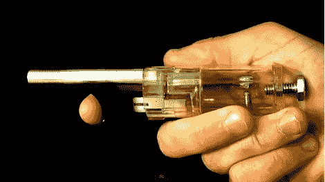

# 由烧烤打火机制造的迷你加农炮发射气枪子弹

> 原文：<https://hackaday.com/2011/06/06/mini-cannon-built-from-a-bbq-lighter-fires-airsoft-pellets/>

【夜鹰之光】已经[自制了手掌炮来发射气枪弹丸](http://www.youtube.com/watch?v=QGj8xMDRSQ0)。休息后，他在视频中一步一步地指导我们，他的过程肯定会调用 MacGyver buy，以一种非预期的方式使用常见的部件。

他从一个烧烤打火机开始，卸下螺丝和塑料外壳，接触到作为大炮主体的透明塑料丁烷容器。丁烷被小心地从罐中释放出来，输出阀被修改以接收桶。在这种情况下，旧气枪的枪管被使用，但金属笔外壳也可以做到这一点。打火机上的火花点火器也可以重复使用，但是有两个螺栓被拧进了容器中，并被用作点火线的探针。为了发射这个一次性的奇迹，将浸过 90%酒精的棉签插入左侧的螺栓。插入气枪弹丸后，扣动扳机点燃蒸汽。

 <https://www.youtube.com/embed/QGj8xMDRSQ0?version=3&rel=1&showsearch=0&showinfo=1&iv_load_policy=1&fs=1&hl=en-US&autohide=2&wmode=transparent>

 </body> </html>