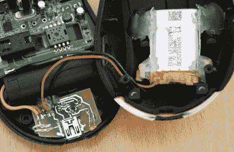

# 带 USB 充电的无线鼠标锂电池改造

> 原文：<https://hackaday.com/2011/06/06/wireless-mouse-li-poly-retrofit-with-usb-charging/>

众所周知，无线鼠标可以很快吃掉电池。与其随时准备新的 AAs，Phil 决定把他的鼠标换成可充电的锂聚合物电池。

这并不是我们第一次看到手机电池被塞进鼠标来增加容量，但我们认为这一次做得非常好。[Phil]设法在鼠标的掌托上安装了一块 2.7-4.2v 的锂电池，那里还有一点多余的空间。电池可以通过定制的充电模块从任何 USB 端口充电，他使用 MAX1555 充电控制器构建了这个模块。另一个定制的电路位于之前由 AA 电池占据的空间，它使用 MC340063 直流到 DC 转换器将电池电压降至鼠标所需的 1.25v。

[菲尔]唯一不满意的部分是底部的电源开关，但是因为你很少看到，我们可以不太在意。我们认为它做得很好，随着第二个版本已经在工作中，我们预计它会变得更好。

请务必查看[Phil]的黑客视频之旅，您可以在下面看到。

 <https://www.youtube.com/embed/kpf-XYT0LFE?version=3&rel=1&showsearch=0&showinfo=1&iv_load_policy=1&fs=1&hl=en-US&autohide=2&wmode=transparent>

 </body> </html>