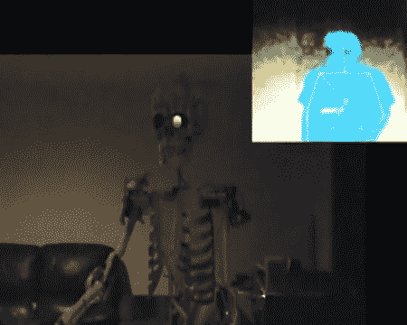

# Kinect 控制的僵尸骨架

> 原文：<https://hackaday.com/2011/06/07/the-kinect-controlled-zombie-skeleton/>

尽管市面上不乏 Kinect hacks，但来自 [Dashhacks](http://kinect.dashhacks.com/kinect-hacks/2011/05/18/kinect-controlled-animatronic-cyborg-zombie "kinect controlled cyborg zombie thing") 的这款似乎特别酷。根据他们的说法，这种设计的软件部分使用了“修改后的 OpenNI 编程和 GlovePIE 一起向机器人发送 WiiMote 命令，如下巴和躯干移动以及 MorphVOX，以创建控制论怪物的声音。”正如视频中所指出的，这种机器人僵尸还具有“暂停”功能，以及像在游乐园那样循环移动的功能。

关于这个黑客的另一个伟大的事情是如何通过伺服电机驱动骨骼。虽然很难判断这个机器人使用了多少伺服系统，但它肯定在头部、双臂和躯干之间有 10 个或更多的自由度。为了控制这一切，一个被黑掉的 Wiimote 和 Nunchuck 与 Kinect 结合使用。休息之后请看视频。

 <https://www.youtube.com/embed/ZEZuvCUOOdE?version=3&rel=1&showsearch=0&showinfo=1&iv_load_policy=1&fs=1&hl=en-US&autohide=2&wmode=transparent>

 
这个机器人应该有一个光明的未来，在这个晚上或者可能在迪斯尼世界。对于另一个不错的 Kinect 黑客，检查这个<a href="http://hackaday.com/2011/06/04/two-kinnects-plus-one-hd-projector-makes-the-coolest-snowglobe-ever/" title="&quot;3d orb thing&quot;">“psudo-3d orb”</a>或者对于一些更简单的电子动画，这个<a href="http://hackaday.com/2011/05/23/an-odd-little-box/" title="an odd little box">“遥控器”</a>可能会很有趣。
 </body> </html>