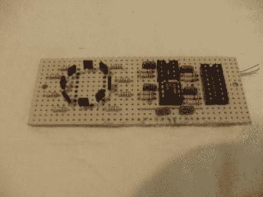

# DIY 地震探测器

> 原文：<https://hackaday.com/2011/06/08/diy-earthquake-detector/>

有些动物似乎能够察觉地震。一些动物也利用地球磁场导航。从这两件事可能有某种关系的想法出发，这个[实验型地震检测仪](http://hackedgadgets.com/2011/05/01/diy-earthquake-detection/ "experimental earthquake detector")诞生了。[【鲍伯·戴维斯】](http://bobdavis321.blogspot.com/ "Bob Davis")建造了这个设备，它使用一个 Arduino 和几个霍尔效应传感器来检测和记录磁场。可能在记录了足够的数据后，可以发现这两种现象之间的相关性。

该设备中的传感器被布置成测量四个方向以及垂直轴上的磁性。这背后的部分想法是，在地震前，地下的石英移动产生磁场。

在休息后的视频中，Bob 介绍了该设备背后的一些理论背景，并谈到了第一个版本(早在 2000 年建造)，该版本使用 PC 进行控制和记录。非常有趣的东西，所以休息之后一定要听鲍勃的解释。

 <https://www.youtube.com/embed/Fz7FeHCkpOM?version=3&rel=1&showsearch=0&showinfo=1&iv_load_policy=1&fs=1&hl=en-US&autohide=2&wmode=transparent>

 </body> </html>