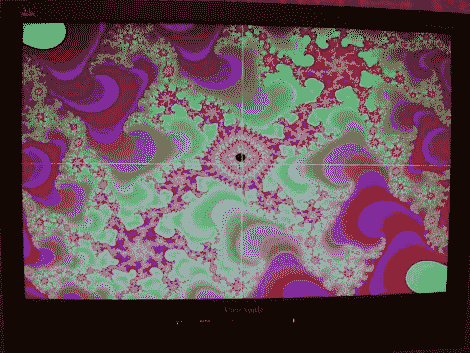

# FPGA Mandelbrot 分形引擎

> 原文：<https://hackaday.com/2011/06/07/fpga-mandelbrot-fractal-engine/>

[Mike Field] [自从他在 80 年代第一次读到 Mandelbrot Set](http://ec2-122-248-210-243.ap-southeast-1.compute.amazonaws.com/mediawiki/index.php/Mandelbrot) 以来，他一直对它很感兴趣。当他在 Commodore VIC20 上编写代码后，当他想尝试一些新的编程技术时，他总是会回到 Mandelbrot set。

他想更深入地研究 FPGAs 的世界，所以[Mike]认为最好的方法是用它来编写 Mandelbrot 分形引擎。他一开始的目标是创建一个 640×480 的 Mandelbrot 显示器，但随着时间的推移，他发现他可以将他的 Nexus 2 FPGA 推到 800×600。他并没有就此止步，在微调了几个东西之后，他惊奇地发现，他可以从小板上推一个 1024×768 的显示器。

如果你也有兴趣尝试这个过程，他会在进行过程中做一个非常详细的日志。虽然没有 FPGA 运行的视频，但有一些很酷的图片展示了他的作品。