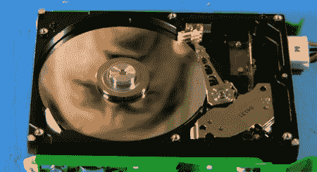

# 硬盘拆卸

> 原文：<https://hackaday.com/2011/06/07/hard-drive-teardown/>

你知道现代的[硬盘是如何工作的吗](http://www.youtube.com/watch?v=Wiy_eHdj8kg "hard drive works")？如果你不知道，看完这段视频后，你应该会有一个很好的想法。仅在五分钟内[Bill Hammack]成功地描述了一个令人敬畏的硬盘驱动器的细节，而没有使用任何不必要的科学术语。

视频拆解解释了飞行头如何“飞行”音圈电机如何工作，并提供了二进制数据如何在磁盘中存储和处理的基本介绍。飞行头保持与板块微小距离的方式特别巧妙。你可能还记得工程师拆除液晶显示器的场景，同样详细而有趣。休息后的视频绝对值得一看。

[https://www.youtube.com/embed/Wiy_eHdj8kg?version=3&rel=1&showsearch=0&showinfo=1&iv_load_policy=1&fs=1&hl=en-US&autohide=2&wmode=transparent](https://www.youtube.com/embed/Wiy_eHdj8kg?version=3&rel=1&showsearch=0&showinfo=1&iv_load_policy=1&fs=1&hl=en-US&autohide=2&wmode=transparent)