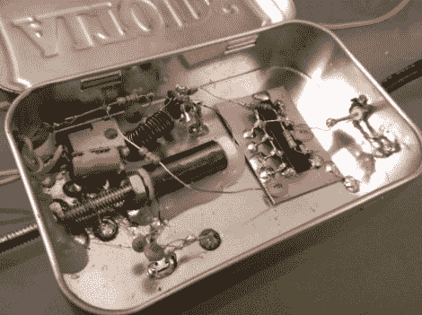

# 用磁导率调谐振荡器做实验

> 原文：<https://hackaday.com/2011/06/08/experimenting-with-a-permeability-tuned-oscillator/>

[Scott Harden]一直致力于设计一种可变电感，用作 PTO 或磁导率调谐振荡器。你在上面看到的是这些努力的最新成果。可变感应器由绿色线圈组成，线圈芯中有一个螺栓。转动该螺栓会将线圈的尖端移进或移出线圈，从而影响其电感。

传统上，调谐 RF 振荡器电路是可调电容器的功能。但是电容只是电路的一部分，电感是另一个重要部分。由于能够对电路频率产生巨大影响的可变电容器非常昂贵，他开始寻找另一种方法。这就是促使他开发第一个 PTO 项目的原因。

[Scott]制作了上面看到的硬件演示视频，我们在休息后嵌入了该视频。

 <https://www.youtube.com/embed/jm3a1OqNFVI?version=3&rel=1&showsearch=0&showinfo=1&iv_load_policy=1&fs=1&hl=en-US&autohide=2&wmode=transparent>

 </body> </html>