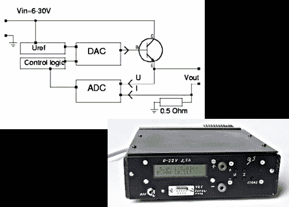

# 设计和制造长凳用品

> 原文：<https://hackaday.com/2011/06/08/designing-and-building-a-bench-supply/>

[斯科特的]一直在挖掘互联网的过期问题，以找到这个项目。他掸掉灰尘，发给我们一篇文章的链接，这篇文章介绍了台式电源的设计和制造过程。

[Guido Socher]出色地展示了他的长凳供应项目。很多其他人展示了最终产品，但他特意确保我们理解了其中的设计原则。他首先谈到最简单的电源设计:一个晶体管和齐纳二极管，产生一个参考电压。他接着讨论了这个简化电路的问题以及如何解决这些问题，涵盖了该过程中每一步可能出现的问题。

一旦他设计好电路，并布置好一些电路板，他就开始建造一个围栏。我们喜欢他关于使用大头针和未填充的通孔 PCB 来标记外壳前挡板上的按钮位置的提示。最终的设计如上所示，包括一个笔记本电脑砖，将主电源转换为 24V 3A DC 馈给定制电路。