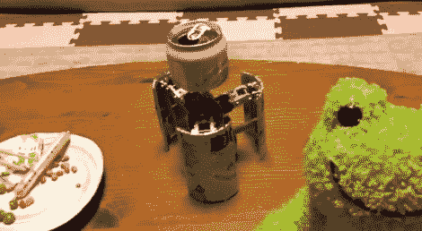

# 微型变形啤酒罐机器人

> 原文：<https://hackaday.com/2011/06/08/tiny-transforming-beer-can-robot/>

下次你去拿冰镇啤酒时，你可能会想看一眼罐子，以确保你的啤酒不会突然长出腿来，并开始在桌子上跳跃。

你可能会记得[Ron Tajima]以前的一些创作，包括这个基于 Roomba 的婴儿摇篮和[PacMan Roomba mod](http://hackaday.com/2008/06/03/roomba-pac-man/)。这一次，他创造了一个很酷的小变形机器人，可以放在啤酒罐里。

机器人的大脑就储存在啤酒罐顶部下面一个定制的板子上。在电路板的一侧，您会发现一个 mbed 控制器，用于管理机器人的所有功能，在另一侧，四块电池为设备提供所有电源。机器人的三条腿由六个伺服系统控制，允许在几个不同的平面上移动。啤酒机器人的动作是由遥控器控制的，所以我们假设他在那里的某个地方也塞了一个蓝牙模块。

[Ron]提到它直立时移动有点慢，但我们认为这个机器人很棒，我们迫不及待地想看到下一个版本会带来什么改进。

留下来看看机器人的视频演示。

[谢谢萨沙]

 <https://www.youtube.com/embed/7hag6Zgj78o?version=3&rel=1&showsearch=0&showinfo=1&iv_load_policy=1&fs=1&hl=en-US&autohide=2&wmode=transparent>

 </body> </html>