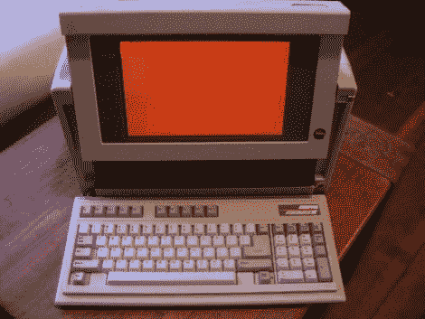

# 康柏便携式 III 为崇高的事业再次崛起

> 原文：<https://hackaday.com/2011/06/09/compaq-portable-iii-rises-again-for-a-noble-cause/>

在[自由极客温哥华](http://www.freegeekvancouver.org/)发现了一台康柏笔记本 III 。他一看才知道[还能打](http://freegeekvancouver.blogspot.com/2011/06/old-gear-lives-on-hack-part-2.html)；在他当地的咖啡店里对抗潮人的暴政和他们闪亮的 Macbook Pros。不幸的是，作为一个 286，计算机不能做太多。他可以走[通常的路线](http://hackaday.com/2008/01/13/24th-anniversary-macintosh/)；也就是去掉所有的内部部件，利用大量的空间在里面安装一台更现代的电脑。然而，他决定走一条不同的道路，保存内部，让它在原来的工作秩序。这台电脑没有足够的能力浏览网页，但它有足够的空间将一台[小型单板电脑](http://www.cpuboards.com/cpu-boards/gene-4310.htm)放在里面；他可以通过串口连接。他还没有带着它去咖啡店，但是我们希望当他带着它去的时候，会有一些震惊的潮人和一份完整的任务报告。

[由 Alec Smecher 发送]