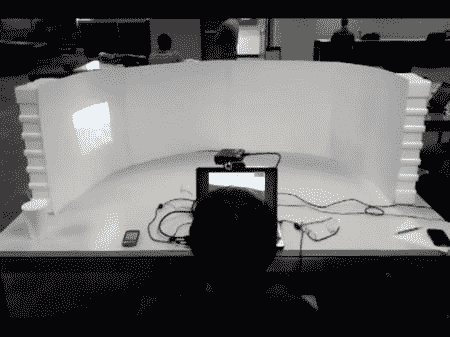

# 用微型投影仪实现虚拟现实

> 原文：<https://hackaday.com/2011/06/10/virtual-reality-with-a-pico-projector/>

虽然虚拟现实在 90 年代初是未来的潮流，但它并没有像我们希望的那样真正起飞。有时候一个伟大的想法需要时间让技术赶上它。).现在，微型投影仪、逼真的 FPS 游戏和眼球追踪系统的价格已经下降，[这个由德克萨斯大学奥斯丁分校的学生设计的头部追踪投影系统](http://www.engadget.com/2011/05/02/gaming-gets-immersive-thanks-to-union-of-pico-projector-and-eye/ "projection system")可能会成为一些非常好的东西的开始。

虽然我们以前见过一些很酷的[FPS/微型投影仪黑客](http://hackaday.com/2010/05/10/fps-controller-hacks-getting-easier/ "pico projector gaming rig")，但大多数都使用“枪”作为控制器。这种方法提供了一种不同的体验，因为人们不需要随身携带“枪”。它只是跟踪一个人的眼球运动，并自动移动投影仪。休息之后，请观看视频，了解这款设备的运行情况。

 <https://www.youtube.com/embed/z629I7tQUh0?version=3&rel=1&showsearch=0&showinfo=1&iv_load_policy=1&fs=1&hl=en-US&autohide=2&wmode=transparent>

 </body> </html>