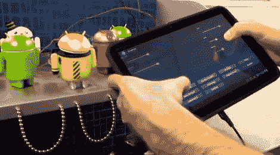

# 平板电脑控制的迪斯科机器人

> 原文：<https://hackaday.com/2011/06/09/tablet-controlled-disco-droid/>

自从几周前宣布以来，我们已经看到一些整洁的谷歌 ADK 项目出现，[并且这个项目已经在我们最喜欢的列表上了](http://blog.makezine.com/archive/2011/06/dancing-android-adk-robot-tablet-interface.html)。

YouTube 用户[chrisjrelliot]制作了一个很棒的黑客程序，展示了 ADK 的强大功能，以及使用 Android 设备实时控制设备是多么容易。

他(自然地)拆开了一个机器人模型，给它装上了一些 LED 眼睛和四个伺服系统。伺服系统用于旋转他的迪斯科机器人的头部、身体和手臂，所有这些都可以通过他的安卓平板电脑控制。正如你在下面的视频中看到的，他能够通过手指的几个简单滑动来实时控制机器人的行动。我们注意到的一件事是，他的平板电脑没有通过电线连接到任何东西，所以我们假设有一个蓝牙模块隐藏在组合中的某个地方。

虽然视频在细节上有点欠缺，但[Chris]承诺源代码和构建计划将在短期内发布。

 <https://www.youtube.com/embed/jwvkJVUECrg?version=3&rel=1&showsearch=0&showinfo=1&iv_load_policy=1&fs=1&hl=en-US&autohide=2&wmode=transparent>

 </body> </html>