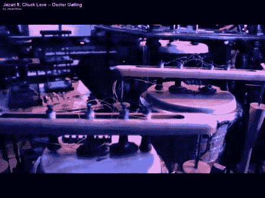

# 贾扎里机器人爵士乐合奏团

> 原文：<https://hackaday.com/2011/06/11/the-jazari-robotic-jazz-enesmble/>

任何去过 Chuck E Cheese 的人都知道，机器人乐队已经开发了多年。帕特里克·弗拉纳根的电子人打击乐器合奏团[贾扎里](http://jazarimusic.com/ "the Jazari")似乎将事情带到了一个新的水平。

正如帕特里克所描述的，贾扎里“将非洲节奏、
算法作曲、电脑音乐和电子机械融合到
节拍驱动的蒸汽放克音乐中。”控制也非常独特。最初，控制器只是一个 Wiimote。这是有限的，因为一个人需要三个手指来抓住它，所以一个新的[“跳羚”](http://en.wikipedia.org/wiki/Springbok "the springbok")设备诞生了，允许所有的五个手指用来演奏音乐。音乐的声乐部分是使用一个名为“voloco”的 Android 程序创建的。

休息后的视频应该可以更好地解释一切，音乐本身也很酷。Patrick 将在这个夏天做更多的编程和硬件工作，而不是巡回演出，但是一旦所有的错误都解决了,“他们”应该会举办一场令人敬畏的音乐会。

 <https://www.youtube.com/embed/f5DgC-SOXmU?version=3&rel=1&showsearch=0&showinfo=1&iv_load_policy=1&fs=1&hl=en-US&autohide=2&wmode=transparent>

 </body> </html>