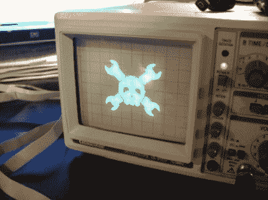

# 在示波器上显示图形

> 原文：<https://hackaday.com/2011/06/10/displaying-graphics-on-an-oscilloscope/>

[Andrew Rossignol]有一天很好奇，在摆弄了 X 和 Y 输入后，他决定在示波器上显示图形。

[Andrew]从他的 AVR Butterfly 的 DAC 上的电阻梯开始。他能够在示波器的屏幕上画一条线，但是带宽的限制迫使他重新考虑他的方法。一个朋友写了一个 Python 脚本来生成 C 代码，这样可以切换 Butterfly 的端口。在让蝴蝶为每个非白色像素产生电压后，[Andrew]对结果印象深刻，因此修改了代码以确定每个像素的亮度。设置管理 10 个灰色阴影，并仔细选择在构建日志上发布什么图形，确保项目有一点点博客信誉。

有几种方法可以在示波器上显示图像，比如[将 Hsync 和 Vsync 插入示波器的输入端](http://hackaday.com/2011/03/30/oscilloscope-thinks-its-a-video-monitor/)。除了一些[音乐可视化](http://hackaday.com/2011/04/14/analog-scope-stands-in-to-for-laser-light-show/)，我们还没有看到微控制器产生的示波器显示。干得好[Andrew]，但我们想提一下，很久以前就有一个[灰度 Hack a Day 徽标](http://www.weblogsinc.com/commimg/4979866997687398.JPG.2993447557774269)。

休息之后，请观看[Andrew]示波器的视频。

 <https://www.youtube.com/embed/uYMxPjOw0gA?version=3&rel=1&showsearch=0&showinfo=1&iv_load_policy=1&fs=1&hl=en-US&autohide=2&wmode=transparent>

 </body> </html>