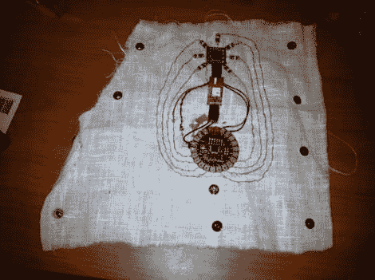

# 前臂安装的 GPS 使用发光二极管照亮回家的路

> 原文：<https://hackaday.com/2011/06/10/forearm-mounted-gps-uses-leds-to-light-the-way-home/>

虽然有些人可以完全依靠记忆和路标找到回家的路，但其他人需要更多的帮助。以 [Instructables 用户[_macke_]](http://www.instructables.com/id/Find-home-detector) 为例。

像我们见过的其他[无屏幕 GPS 导航设备](http://hackaday.com/2011/03/20/gps-enabled-bag-allows-for-carefree-city-roaming/)一样，他的“找到家探测器”使用 GPS 模块来获取他的位置，通过一组备用指示器指引回家的路。在这种情况下，他使用了像罗盘一样排列的 led。当[_macke_]瞄准他的目的地时，离他指尖最近的 LED 灯会亮起，让他知道自己走对了路。当他转身离开家时，其他的发光二极管亮起，指示他应该转向的方向。

他前臂安装的 GPS 导航器使用 LilyPad Arduino 来控制系统，就像我们见过的其他系统一样。它连接到一个 GPS 传感器和一个指南针模块，协同工作，引导他回家。指南针负责获取他的航向信息，虽然看起来好像模块周围的 led 指向北方，但实际上它们指示的是他的目的地的航向。

这是一个很酷的小发明，我们可以想象，如果你在喝了一整夜的酒后正走在回家的路上，它会很有帮助。

请务必观看下面的视频进行快速演示。

 <https://www.youtube.com/embed/sKmZI0tL5UA?version=3&rel=1&showsearch=0&showinfo=1&iv_load_policy=1&fs=1&hl=en-US&autohide=2&wmode=transparent>

 </body> </html>