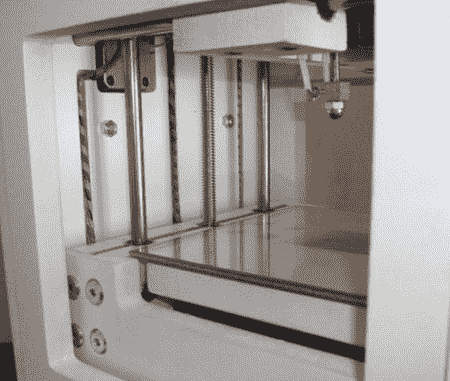

# 3D 打印机看起来像是工厂制造的

> 原文：<https://hackaday.com/2011/06/11/3d-printer-looks-factory-made/>

[Richard Sum]想出了一个很棒的 3D 打印机，并将他的项目作为一个活动放在 IndieGoGo 上。

[Richard]的“SUMPOD”像许多其他 3D 打印机一样基于 reprap，但 SUMPOD 看起来很专业；这台打印机看起来像是来自工厂的东西。我们认为在这台打印机的设计和制造上花了很多心思。

这台机器的规格也不算太差。它的建造面积为 150×150×100 毫米，比 Makerbot 的 Thing-O-Matic 大近 2 英寸。我们向[Richard]询问了机器的驱动系统，他告诉我们 x 轴和 y 轴有一个线性轴承/皮带装置，z 轴有一个螺旋驱动装置。电子设备是标准的 NEMA 17 发动机和 reprap [RAMPS](http://reprap.org/wiki/RAMPS) fare，所以所有的电子设备都是可靠的。

[Richard]计划为 pcb 和 [lithophane](http://en.wikipedia.org/wiki/Lithophane) 铣削添加 Dremel 附件。我们希望一些 SUMPOD 的设计文件发布，但同时我们真的很期待看到这个项目的进展。