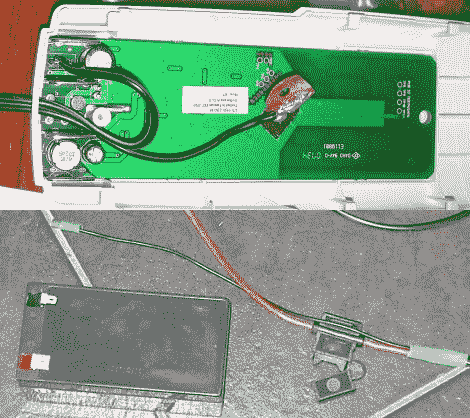

# 修复电动百叶窗电池问题

> 原文：<https://hackaday.com/2011/06/12/fixing-motorized-window-shutter-battery-problems/>

住在一个容易发生火灾的地方，[Erich]安装了一套卷帘来保护他的家。在紧急情况下，主电源可能会不稳定，因此快门由镍氢电池供电，这些电池位于快门的远程控制单元内。在遇到了大量的废电池后，[他决定是时候寻找一种更好的方法来给百叶窗供电了，而不是再花 80 澳元去买他知道很快就会失效的电池。](http://vk5hse.blogspot.com/2011/06/fixing-ozroll-roller-shutter.html)

拆开百叶窗和遥控器后，他发现了一连串的问题。遥控器是基于 ATMega 的，所以他认为程序是健壮的，但是他发现收费算法执行得很差。充电时，电池会变得非常热，这是因为充电是在设定的时间段内进行的，而不是监控电池电压。此外，快门电机启动时需要 4 安培的瞬时电流，这似乎有助于快速消耗 1500 毫安的电池组。

为了解决他的问题，他升级到一个更大的密封铅酸电池组，他把它安装在一个墙洞里。遥控器被调整为添加模块化电源插头，使他能够根据需要轻松连接和断开遥控器。他不仅在不断更换电池上节省了一大笔钱，他在墙上有一个很好的 12v 电源，他可以随意接入。