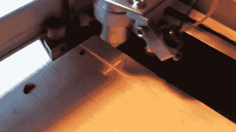

# 激光切割机的十字准线瞄准系统

> 原文：<https://hackaday.com/2011/06/12/crosshair-aiming-system-for-your-laser-cutter/>

[Rich]用他新买的激光切割机玩得很开心，但是[对它附带的枪托瞄准激光](http://nothinglabs.blogspot.com/2011/06/20-laser-cutter-crosshair-aiming-system.html)不感兴趣。内置激光器的问题是，它实际上并没有跟随切割激光的路径，而是必须针对固定的焦距进行校准。由于雕刻和切割需要不同的焦距，这在雕刻和切割时就成了问题，因此切割激光相对于瞄准激光的实际终止位置就成了猜谜游戏。

一个额外的光学模块可以解决这个问题，价格约为 300 美元，但在花了 2500 美元购买激光装置后，[Rich]不打算购买。相反，他在网上买了一对便宜的激光水平仪，并从一个模块中回收了线透镜，该模块安装在激光切割机现有的瞄准激光器上。第二个模块用环氧树脂固定在切割头的顶部，以在工作面上创建一组十字线。

正如你在下面的视频中看到的，黑客工作得很好，激光在各种不同的焦距上都很准确。

 <https://www.youtube.com/embed/IAcZ7tL-ZpY?version=3&rel=1&showsearch=0&showinfo=1&iv_load_policy=1&fs=1&hl=en-US&autohide=2&wmode=transparent>

 </body> </html>