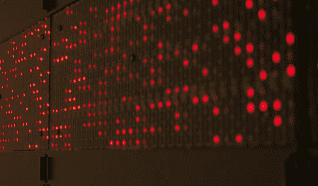

# 拯救多余的闪光灯

> 原文：<https://hackaday.com/2011/06/12/rescuing-surplus-blinkenlights/>

因为拥有 20 世纪 90 年代早期超级计算机的剩余 LED 面板是完全合理的事情，[威廉·狄龙]开始在他的墙上展示它们。

LED 面板来自一台多余的 [CM-5 连接机](http://en.wikipedia.org/wiki/Connection_Machine)，最出名的是它在《侏罗纪公园》中的主机角色(电影中只使用了一个装有 LED 面板的空箱子)。当不在努布拉岛时，连接机器是 20 世纪 80 年代人工智能复兴时期的一个神话般的工程作品。一些机器有 65，536 个处理器，它被用于使用 Lisp 的人工智能研究(尽管我们从来不擅长 Lisp。

[William]用 1×2 英寸的枫木做了一个木框，并在面板后面安装了一个 X10 模块作为远程开关。面板本身不受电脑控制，所以剩下唯一要做的就是安装电源。令人印象深刻的是，当面板仅消耗 7 安培时，设计用于 5V @ 30A 的大规模过度设计的电源。[William]说这是连接机器的一个设计特点，可以节省费用。

[William]的下一个计划是对面板进行逆向工程，以显示定制的信息，我们迫不及待地想看看他会拿出什么。我们不能解释为什么，但我们真的想建立一个这样的面板。看看[威廉]退役 CM-5 的[图片](http://alternet.us.com/?p=1287)。