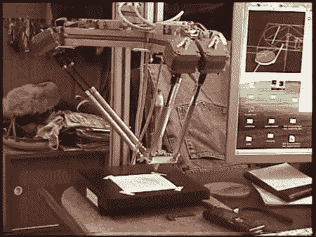

# 三脚架数控绘图仪

> 原文：<https://hackaday.com/2011/06/16/tripod-cnc-plotter/>

虽然有些人可能听说过这样的机器，但对于工程界的许多人来说， [CNC 三脚架](http://www.youtube.com/watch?v=LJYhz5aTMnA&feature=player_embedded)仍然是一种未知的机器。这台特殊的机器被设置成绘图仪，可以画出难以置信的直线、形状和字母。

机器似乎有 6 个伺服电机，3 个成对工作。这将简化控制，并允许笔以垂直于纸张的角度握持。人们可以想象用它来代替钢笔、纺锤和磨。这可以用来切割复杂的形状，而不是传统的数控铣床或刳刨机。

此外，如果伺服系统不是在 3 个串联对中被驱动，而是全部被独立控制，则应该可以在受控的角度方向上扭转工具。这将增加一个额外的控制轴到已经强大的 CNC 设置中。看到这项技术在未来如何发展将是令人兴奋的。在那之前，休息后看看视频:

[https://www.youtube.com/embed/LJYhz5aTMnA?version=3&rel=1&showsearch=0&showinfo=1&iv_load_policy=1&fs=1&hl=en-US&autohide=2&wmode=transparent](https://www.youtube.com/embed/LJYhz5aTMnA?version=3&rel=1&showsearch=0&showinfo=1&iv_load_policy=1&fs=1&hl=en-US&autohide=2&wmode=transparent)

此外，对于另一种替代加工方法，看看这个[“数控六足机器人”](http://hackaday.com/2008/06/11/hexapod-cnc-bot/ "CNC hexapod")真的很酷。