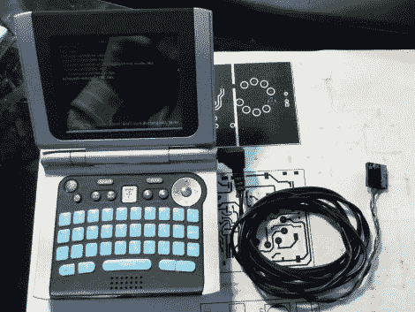

# 带 Zipit 的闪烁 Arduinos

> 原文：<https://hackaday.com/2011/06/13/flashing-arduinos-with-a-zipit/>

[贾科莫]发现，每隔一段时间，[他需要在旅途中向 Arduino 闪现草图](http://giferrari.net/blog/?p=76)。虽然他并不总是随身携带笔记本电脑，但几乎可以肯定的是，他的 Zipit Z2 就在手边。他更喜欢使用 Zipit，因为它很小，使用 Debian，内置 WiFi，在需要充电之前可以运行大约 5 个小时。唯一的缺点是该设备缺少串行端口。

[按照我们去年介绍的说明](http://hackaday.com/2010/06/24/adding-a-serial-port-to-the-zipit/)他为他的设备添加了一个串行端口，然后构建了一个小型转换器电缆，使他可以将其连接到几乎任何 Arduino。他说，通过 apt-get，只需要一会儿就可以让 avrdude 在 Zipit 上运行起来，一旦完成，他就可以开始工作了。他写了一个简短的脚本，使他不必一遍又一遍地输入 flash 命令，所以这个过程再简单不过了。

他提到，由于 Zipit 没有 DTR 线，Arduino 重置必须手动完成。为了方便从我们的手掌中闪现草图，我们可以处理它。

查看下面的视频，快速演示他的设置。

[https://www.youtube.com/embed/vQoZqqiEE6o?version=3&rel=1&showsearch=0&showinfo=1&iv_load_policy=1&fs=1&hl=en-US&autohide=2&wmode=transparent](https://www.youtube.com/embed/vQoZqqiEE6o?version=3&rel=1&showsearch=0&showinfo=1&iv_load_policy=1&fs=1&hl=en-US&autohide=2&wmode=transparent)